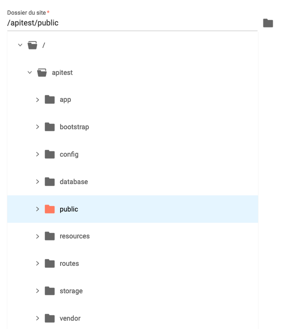
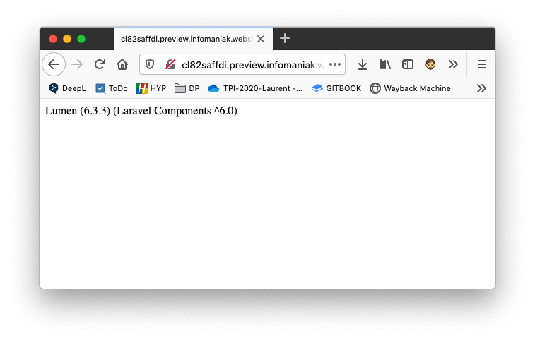
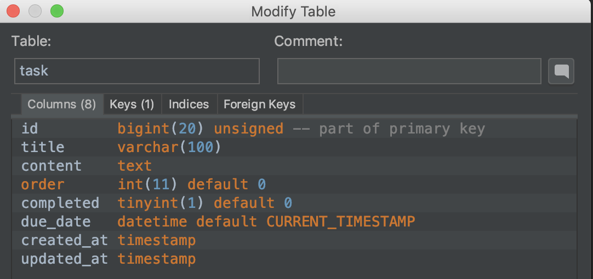

# Création d'une API avec Lumen

## Sommaire

[Sources](#sources)

[Environnement de développement](#environnement-de-développement)

[Installer Lumen](#installer-lumen)

[Création de la base de données](#création-de-la-base-de-données)

[Création du modèle `Task`](#création-du-modèle-task)

[Création des routes de l'API](#création-des-routes-de-lapi)

[Création du controller `TaskController`](#création-du-controller-taskcontroller)

[Test des routes avec Postman](#test-des-routes-avec-postman)

[CORS](#cors)

[Authentification TOKEN](#authentification-token)

[API Documentation Generator](#api-documentation-generator)


## Sources

* https://auth0.com/blog/developing-restful-apis-with-lumen/
* https://www.infomaniak.com/fr/support/faq/1941/se-connecter-en-ssh-et-utiliser-des-commandes-en-ligne
* https://www.infomaniak.com/fr/support/faq/2108/configurer-changer-la-version-de-php-utilisee-en-ssh
* https://fr.wikipedia.org/wiki/Secure_Shell


## Environnement de développement

Installer les outils suivants :

* (iOs) Homebrew : https://brew.sh/index_fr
* git : https://git-scm.com/
* Composer : https://getcomposer.org/download/

Créer un nouveau schéma `tasks` sur votre base de donnée MySQL.

## Installer Lumen
### Sur un serveur local

Exécuter la commande suivante dans le terminal pour créer un nouveau projet Lumen :

```shell
composer create-project --prefer-dist laravel/lumen lumen-api
```

Monter dans le nouveau dossier

```shell
cd lumen-api
```

Démarrer le serveur php, et tetser le bon fonctionnement de lumen : http://localhost:8000/

```shell
php -S localhost:8000 -t public
```


### Sur un serveur distant avec SSH 

***Secure Shell*** (**SSH**) est à la fois un [programme informatique](https://fr.wikipedia.org/wiki/Programme_informatique) et un [protocole de communication](https://fr.wikipedia.org/wiki/Protocole_de_communication) sécurisé. 

Pour se connecter en SSH, il est nécessaire d'installer ou d'activer un logiciel sur certains systèmes d'exploitation : 

- Terminal (application déjà intégrée à macOS et Linux)
- [PuTTY](http://www.putty.org/) (Windows)
- Client SSH de Windows 10 (aide [en français](https://www.pcastuces.com/pratique/astuces/5235.htm) / [en anglais](https://www.howtogeek.com/336775/how-to-enable-and-use-windows-10s-built-in-ssh-commands/))


#### Se connecter au serveur

Exécutez ensuite la commande suivante:

```
ssh username@server
```

- **Username** étant le nom d'utilisateur du compte FTP et
- **Server** étant le serveur hôte (par ex.: xxxx.ftp.infomaniak.com).

Pour savoir quelle commande est disponible et connaitre le chemin à utiliser, tapez la commande `whereis`. Exemple:

```bash
# MySQL
whereis mysqlmysql: /opt/mysql/bin/mysql

# Composer
whereis composer
composer: /usr/bin/composer /opt/php7.2/bin/composer.phar /opt/php7.2/bin/composer /opt/php7.0/bin/composer.phar /opt/php7.0/bin/composer

```


#### Configurer / changer la version de PHP utilisée en SSH

1. Créer un fichier `.profile` s'il n'existe pas:

```bash
touch ~/.profile
```

2. éditer le fichier `.profile` :

```bash
nano ~/.profile
```

3. ajouter ce code à l'intérieur du fichier pour choisir la version de php souhaitée:

```bash
export PATH=/opt/php7.2/bin:$PATH
```

4. charger le fichier `.profile` :

```bash
source ~/.profile
```

5. vérifier la version de php:

```bash
php -v
```


#### Installer composer

Avant d'installer composer tester s'il est présent sur votre serveur avec la commande suivante :

```bash
# Connaitre la version de composer
composer -v
# ou sur certains serveurs
composer.phar -v

# Pour savoir les version disponibles et son emplacement
whereis composer
```

Si Composer n'est pas installé, il faudra le faire vous-même : https://getcomposer.org/ 


#### Installer Lumen

Exécuter la commande suivante dans le terminal pour créer un nouveau projet Lumen :

```shell
composer create-project --prefer-dist laravel/lumen lumen-api
```


#### Définir le dossier du site

Dans la console d'administration de votre hébergeur, configurer le dossier `/lumen-api/public/` comme étant le dossier de votre site.




### Valider l'installation de Lumen

Ouvrez votre la page d'accueil de votre API dans une navigateur et vous devriez avoir le résultat suivant. Hormis la version de Laravel qui sera certainement plus élevée 😅





### Eloquent et Facades

#### Eloquent

ORM inclu avec Laravel facilitant l'interfacage avec une base de données.

Chaque table de la base est représentée par un **Model PHP** qui est utilisé pour intéragir avec les données.

ORM (object-relational mapping)  : interface entre un programme applicatif et une base de données relationnelle.

#### Facades

Fournit une interface **statique** des classes disponibles dans les différents sercvices de l'application.

Les Facades de Laravel sont définies dans le namespace `Illuminate\Support\Facades`.

#### Paramètre BD

Modifier les paramètres base de données du fichier `.env`

```
DB_CONNECTION=mysql
DB_HOST=127.0.0.1
DB_PORT=3306
DB_DATABASE=tasks
DB_USERNAME=root
DB_PASSWORD=
```

#### Activation de Eloquent et Facades

Ouvrir le fichier `bootstrap/app.php` et décommenter les lignes suivantes :

```php
// $app->withFacades();
// $app->withEloquent();
```


## Création de la base de données

La création des tables de la base de données se fera via des migration.

> Les migrations sont comme un outils de versionning pour votre base de données, elles permettent à votre équipe de facilement modifier et partager le shéma de la base de données.

### Migration `create_task_table`

Entrez la commande suivante pour créer le fichier de migration de la future table task.

```shell
php artisan make:migration create_task_table
```

La nouvelle migration sera créée dans le dossier `datables/migrations`.

Le nom des fichiers de migration se compose d'un timestamp permettant à Lumen de déterminer l'ordre des migrations. Exemple : `2019_04_08_135158_create_task_table.php`

Ouvrez le fichier de migration et modifier le comme suit :

```php
<?php

use Illuminate\Support\Facades\Schema;
use Illuminate\Database\Schema\Blueprint;
use Illuminate\Database\Migrations\Migration;

class CreateTaskTable extends Migration
{
    /**
     * Run the migrations.
     *
     * @return void
     */
    public function up()
    {
        Schema::create('task', function (Blueprint $table) {
            $table->bigIncrements('id'); // ID
            $table->string('title', 100); // Titre de max 100 caractères
            $table->text('content')->nullable(); // Contenu détaillé, peut être NULL
            $table->integer('order')->default(0); // Ordre, par défaut 0
            $table->boolean('completed')->default(0); // Tâche terminée, par défaut 0 (false)
            $table->dateTime('due_date')->useCurrent(); // Date de fin, par défaut heure et date actuelle
            $table->timestamps(); // Ajoute le champs mouchards created_at et updated_at
        });
    }

    /**
     * Reverse the migrations.
     *
     * @return void
     */
    public function down()
    {
        Schema::dropIfExists('task');
    }
}
```

### Création de la table `task` dans la base

Excéucter la migration avec la commande suivante.

```shell
php artisan migrate
```

Vérifier que la table `task` a correctement été créée dans votre base de données.




## Création du modèle `Task`

L'ORM Eloquent que nous avons précédement activé, offre une implémentation pour travailler avec votre base de données. 

Chaque table de base de données a un "Modèle" correspondant qui est utilisé pour interagir avec cette table. Les modèles vous permettent d'interroger les données de vos tables et d'insérer de nouveaux enregistrements dans la table.

Les modèles se trouvent dans le dossier `app/` de Lumen. 

Créez le fichier `app/Task.php` en y ajoutant le code suivant :

```php
<?php

namespace App;

use Illuminate\Database\Eloquent\Model;

class Task extends Model
{
    /**
     * Nom de la table associée au modèle
     * Pas nécessaire si vous nommer vos table au pluriel
     *
     * @var string
     */
    protected $table = 'task';

    /**
     * Liste des attributs modifiables
     *
     * @var array
     */
    protected $fillable = [
        'title', 'content', 'order', 'completed', 'due_date'
    ];


    /**
     * Liste des attributs cachés
     * Seront exclus de l'objet JSON dans les réponses
     *
     * @var array
     */
    protected $hidden = ['created_at','updated_at'];
}
```


## Test de la base de données

Pour tester une base de données, il faut avant tout la remplir avec des données de tests, ce que nous ferons avec en définissant des **Factories**.

#### Définir une factory

Les factories sont définies dans  `database/factories/ModelFactory.php`

Ce fichier ce compose d'une factory de démonstration pour le modèle `User`.

Lumen utilise la librairie `Faker` pour générer des données aléatoires qui rempliront la base.

Documentation de Faker : https://github.com/fzaninotto/Faker

##### ModelFactory.php

```php
<?php

/*
|--------------------------------------------------------------------------
| Model Factories
|--------------------------------------------------------------------------
|
| Here you may define all of your model factories. Model factories give
| you a convenient way to create models for testing and seeding your
| database. Just tell the factory how a default model should look.
|
*/

$factory->define(App\User::class, function (Faker\Generator $faker) {
    return [
        'name' => $faker->name,
        'email' => $faker->email,
    ];
});
```


Nous allons définir une factory pour notre modèle `Task` en ajoutant le code suivant à la fin du fichier `ModelFactory.php`.


```php
// Définition d'une factory pour le modèle Task
$factory->define(App\Task::class, function (Faker\Generator $faker) {
    return [
        'title' => $faker->sentence, // Phrase avec texte aléatoire
        'content' => $faker->paragraph, // Paragraphe de textes aléatoires
        'order' => $faker->numberBetween(1,100), // Nombre aléatoire entre 1 et 100
        'completed' => (int) $faker->boolean, // Booléan aléatoire converti en entier
        'due_date' => $faker->date('Y-m-d H:i:s') // Date aléatoire au format MySQL
    ];
});
```


```php
use DatabaseMigrations; // Rollback la BD après chaque tests => Supprime les tables
// OU 
use DatabaseTransactions; // Rollback les transactions de chaques tests
```


## Création des routes de l'API

Les routes sont déclarée dans le fichier `routes/web.php` de Lumen. Ouvrez ce fichier et modifier-le comme suit :

```php
<?php

/*
|--------------------------------------------------------------------------
| Application Routes
|--------------------------------------------------------------------------
|
| Here is where you can register all of the routes for an application.
| It is a breeze. Simply tell Lumen the URIs it should respond to
| and give it the Closure to call when that URI is requested.
|
*/

$router->get('/', function () use ($router) {
    return $router->app->version();
});
// Création du groupr api : http://localhost:8000/api/
$router->group(['prefix' => 'api'], function () use ($router) {

    // Toutes les tâches
    $router->get('tasks',  ['uses' => 'TaskController@showAllTasks']);

    // Détail d'une tâche
    $router->get('tasks/{id}', ['uses' => 'TaskController@showOneTask']);

    // Ajout d'une tâche
    $router->post('tasks', ['uses' => 'TaskController@create']);

    // Suppression d'une tâche
    $router->delete('tasks/{id}', ['uses' => 'TaskController@delete']);

    // Modification d'une tâche
    $router->put('tasks/{id}', ['uses' => 'TaskController@update']);

    // Fermeture d'une tâche : tâche terminée
     $router->put('tasks/{id}/completed', ['uses' => 'TaskController@completed']);

    // Ouverture d'une tâche : tâche non-terminée
     $router->delete('tasks/{id}/completed', ['uses' => 'TaskController@unCompleted']);
});

```

Dans le code ci-dessus, nous avons abstrait la fonctionnalité de chaque route dans un contrôleur, `TaskController`. 

Nous avons également créer un groupe de routes. Les groupes de routes permettent de partager des attributs de routes, tels que des middleware ou des namespaces, sur un grand nombre de routes.

Dans notre exemple, chaque route aura un préfixe `/api`.

Prochaine étape, création du controller `TaskController`.


## Création du controller `TaskController`

Les controlleurs se trouvent dans le dossier `app/Http/Controllers`. 

Créer un fichier TaskController.php et ajoutez-y le code suivant :

```php
<?php

namespace App\Http\Controllers;

use App\Task;
use Illuminate\Http\Request;

class TaskController extends Controller
{

    public function showAllTasks()
    {
        return response()->json(Task::all());
    }

    public function showOneTask($id)
    {
        return response()->json(Task::findOrFail($id));
    }

    public function create(Request $request)
    {
        $task = Task::create($request->all());

        return response()->json($task, 201);
    }

    public function update($id, Request $request)
    {
        $task = Task::findOrFail($id);
        $task->update($request->all());

        return response()->json($task, 200);
    }

    public function delete($id)
    {
        Task::findOrFail($id)->delete();
        return response('Deleted Successfully', 200);
    }

    public function completed($id, Request $request)
    {
        $task = Task::findOrFail($id);
        $task->completed = 1;
        $task->update();

        return response()->json($task, 200);
    }

    public function unCompleted($id, Request $request)
    {
        $task = Task::findOrFail($id);
        $task->completed = 0;
        $task->update();

        return response()->json($task, 200);
    }
}
```

Analysons le code ci-dessus. 

Tout d'abord, il faut importer le modèle `Task`, `use App\Task`. Ensuite nous avons créé les  méthodes  du contrôleur appelées par nos routes.

Par exemple, si vous faites une requête `POST` à `/api/tasks` , la méthode `create` sera appelée.

### Tableau des routes et méthodes contrôleur

| Verbe | Route | Méthode contrôleur | Description |
| -------------- | -------------- | --------------------- | -------------- |
| GET | api/tasks | showAllTasks          | Retourne un tableau de toutes les tâches.                    |
| GET | api/tasks/{id} | showOneTask | Vérifie l'existance de la tâche et la retourne. |
| POST | api/tasks | create | Créer une nouvelle tâche et la retourne. |
| PUT | api/tasks/{id} | update | Vérifie l'existance de la tâche, la mets à jour et la retourne. |
| DELETE | api/tasks/{id} | delete | Vérifie l'existance de la tâche, la supprime et retourne un message de confirmation. |
| PUT | api/tasks/{id}/completed | comleted | Vérifie l'existance de la tâche, mets sa propriété `completed` à `1`, la mets à jour et la retourne. |
| DELETE | api/tasks/{id}/completed | unCompleted | Vérifie l'existance de la tâche, mets sa propriété `completed` à `0` et la retourne. |

Autres infos :

* `response()` est une fonction globale qui retourne une instance de la factory `response`. 
* `response()->json()` retourne simplement la réponse au format JSON.
* `200` est un code d'état HTTP qui indique que la requête a réussi.
* `201` est un code d'état HTTP qui indique qu'une nouvelle ressource vient d'être créée.
* `findOrFail` lance une méthode `ModelNotFoundException` si aucun résultat n'est trouvé.


# Test des routes avec Postman

Avant de commencer :
* Créer des collections avec Postman
* Créer des environnements 
  * https://learning.postman.com/docs/sending-requests/managing-environments/
* Récupéer des données d'une requête et travailler avec des variables
    * Dans l'onglet `Test de la fenêtre d'une requête, on peut récupérer la réponse pour l'injecter dans une variable
```javascript
// Récupère la réponse de la requête
let responseData = pm.response.json();
// Crée une variable de collection et lui affecte une valeur
pm.collectionVariables.set('TOKEN', responseData.access_token)
```
  * Récupérer une variable et l'utiliser dans Postman : `{{NOM_VARIABLE}}`

## Liste des tâches

~~~~

## Détail d'une tâche


### Tâche introuvable - erreur 404


## Ajouter une tâche


## Modifier une tâche


## Supprimer une tâche


## Terminer une tâche


## Ouvrir une tâche


## Validation des données


Dans le développement d'applications, une règle d'or : 

> Ne jamais faire confiance à l'utilisateur, toujours valider les données reçues !

Lumen nous facillite cette tâche en nous fournissant la *helper method* `validate()` de l'objet `Illuminate\Http\Request`.

Si toute les règles de validation passent, le code s'exécutera noremalement. Par contre, s'il une validation échoue, une exception sera soulevée et le message d'erreur correspondant envoyé à l'utilisateur.

Dans le cas d'une requête HTTP classique une réponse de type redirection sera générée, alors qu'une réponse au format JSON sera envoyé pour les requête AJAX.

Ajoutons une validation pour la création d'une nouvelle tâche dans notre contrôleur :

```php
public function create(Request $request)
{
    $this->validate($request, [
        'title' => 'required',
        'order' => 'required|integer|unique:task,order',
        'completed' => 'boolean',
        'due_date' => 'date_format:Y-m-d H:i:s' // ou simplement date
    ]);

    $task = Task::create($request->all());

    return response()->json($task, 201);
}
```

Règles de validation disponibles : https://laravel.com/docs/5.8/validation#available-validation-rules


### Traduire les messages d'erreur

1. Télécharger le fichier de validation `validation.php` de la langue désirée sur ce dépot : https://github.com/caouecs/Laravel-lang. Vous le trouverez la version française dans le sous-dossier  `src/fr/` du dépot.
2. Copier le dans de Lumen à cet emplcement : `resources/lang/fr/validation.php`
3. Définir la langue principale dans `bootstrap/app.php` en ajoutant :
    `app('translator')->setLocale('fr');` avant l'instruction `return $app;`

Vos m'essages s'affichent maintenant en français.

Reste encore à traduire correctement le nom des champs, en les précisant dans le tabelau `attributes` du fichier `resources/fr/validation.php`.

```php
  'attributes' => [
        'name'                  => 'nom',
        'username'              => "nom d'utilisateur",
        'email'                 => 'adresse email',
        'first_name'            => 'prénom',
        'last_name'             => 'nom',
        'password'              => 'mot de passe',
        'password_confirmation' => 'confirmation du mot de passe',
        'city'                  => 'ville',
        'country'               => 'pays',
        'address'               => 'adresse',
        'phone'                 => 'téléphone',
        'mobile'                => 'portable',
        'age'                   => 'âge',
        'sex'                   => 'sexe',
        'gender'                => 'genre',
        'day'                   => 'jour',
        'month'                 => 'mois',
        'year'                  => 'année',
        'hour'                  => 'heure',
        'minute'                => 'minute',
        'second'                => 'seconde',
        'title'                 => 'titre',
        'content'               => 'contenu',
        'description'           => 'description',
        'excerpt'               => 'extrait',
        'date'                  => 'date',
        'time'                  => 'heure',
        'available'             => 'disponible',
        'size'                  => 'taille',
        'order'                 => 'ordre',
        'completed'             => 'terminé',
        'due_date'              => 'date de fin'
    ],
```


## Tests unitaires

Pour créer et lancer les tests, Lumen utilise phpunit : https://phpunit.de/index.html

Les tests se trouvent dans le dossier `tests/` , se dossier contient un exemple de test : `ExampelTest.php` et une classe abstraite dont doivent hériter tous les tests Lumen : `TestCase.php`.

Pour lancer les tests, exécutez la commande suivante dans le terminal :

```shell
./vendor/bin/phpunit
```

Résultat des tests :

```shell
PHPUnit 7.5.8 by Sebastian Bergmann and contributors.

.                                                                   1 / 1 (100%)

Time: 52 ms, Memory: 8.00 MB

OK (1 test, 1 assertion)
```


### Tester la base

Pour tester une base de données, il faut avant tout la remplir avec des données de tests, ce que nous ferons avec en créant des **Factories**.

#### Définir une factory

Les factories sont définies dans  `database/factories/ModelFactory.php`

Ce fichier ce compose d'une factory de démonstration pour le modèle `User`.

Lumen utiliser la librairie `Faker` pour générer des données aléatoires qui rempliront la base.

Documentation de Faker : https://github.com/fzaninotto/Faker

```php
<?php

/*
|--------------------------------------------------------------------------
| Model Factories
|--------------------------------------------------------------------------
|
| Here you may define all of your model factories. Model factories give
| you a convenient way to create models for testing and seeding your
| database. Just tell the factory how a default model should look.
|
*/

$factory->define(App\User::class, function (Faker\Generator $faker) {
    return [
        'name' => $faker->name,
        'email' => $faker->email,
    ];
});
```

Nous allons définir une factory pour notre modèle `Task` en ajoutant le code suivant à la fin du fichier `ModelFactory.php`.

```php
// Définition d'une factory pour le modèle Task
$factory->define(App\Task::class, function (Faker\Generator $faker) {
    return [
        'title' => $faker->sentence, // Phrase avec texte aléatoire
        'content' => $faker->paragraph, // Paragraphe de textes aléatoires
        'order' => $faker->numberBetween(1,100), // Nombre aléatoire entre 1 et 100
        'completed' => (int) $faker->boolean, // Booléan aléatoire converti en entier
        'due_date' => $faker->date('Y-m-d H:i:s') // Date aléatoire au format MySQL
    ];
});
```


```php
use DatabaseMigrations; // Rollback la BD après chaque tests => Supprime les tables
// OU 
use DatabaseTransactions; // Rollback les transactions de chaques tests
```


# CORS
https://www.codementor.io/@chiemelachinedum/steps-to-enable-cors-on-a-lumen-api-backend-e5a0s1ecx

# Authentification TOKEN

https://jwt-auth.readthedocs.io/en/develop/quick-start/

# API Documentation Generator

https://beyondco.de/docs/laravel-apidoc-generator/getting-started/installation
